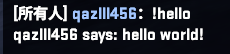

# cs2-HelloWorldPlugin-from-qazlll456

A simple CounterStrikeSharp plugin for Counter-Strike 2 (CS2) that allows players to trigger a "hello world!" message in the chat or console.

## Overview
This plugin adds basic command functionality to your CS2 server using the CounterStrikeSharp framework. Players can type `!hello` in the chat to broadcast a message with their name to all players. Server admins can use the `css_hello` command in the console to print "hello world!".

- **Module Name**: Hello World Plugin
- **Version**: 1.0.0
- **Author**: qazlll456 from HK with xAI assistance
- **Description**: A simple plugin that supports the console command `css_hello` and the chat command `!hello`.

## Requirements
To use this plugin, you need:
- **Counter-Strike 2 Dedicated Server**: A running CS2 server.
- **Metamod:Source**: Installed on your server for plugin support. Download from [sourcemm.net](https://www.sourcemm.net/).
- **CounterStrikeSharp**: The C# plugin framework for CS2. Download the latest version from [GitHub releases](https://github.com/roflmuffin/CounterStrikeSharp/releases) (choose the "with runtime" version if it’s your first install).

## Installation
1. **Download the Plugin**:
   - Grab the latest `.dll` from the [Releases](https://github.com/qazlll456/cs2-HelloWorldPlugin-from-qazlll456/releases) section (once available).
   - Or clone this repository and build it yourself using `dotnet build`.

2. **Install on Your Server**:
   - Navigate to your CS2 server’s plugin folder: `/game/csgo/addons/counterstrikesharp/plugins/`.
   - Create a new folder named `HelloWorldPlugin`.
   - Copy the compiled `HelloWorldPlugin.dll` (and related files like `.deps.json`, `.pdb`) into this folder.

3. **Restart Your Server**:
   - Restart your CS2 server to load the plugin.
   - Check the console for: `Hello World! Plugin Loaded Successfully!`.

## Usage
- **Chat Command**: Players can type `!hello` or `/hello` in chat to broadcast `<playername> says: hello world!` to all players.
- **Console Command**: Admins can type `css_hello` in the server console to print `hello world!`.

## Screenshots
Here’s a screenshot of the plugin in action:

## Building from Source
1. Ensure you have the [.NET 8 SDK](https://dotnet.microsoft.com/en-us/download/dotnet/8.0) installed.
2. Clone this repository: git clone https://github.com/qazlll456/cs2-HelloWorldPlugin-from-qazlll456.git
3. Navigate to the project folder and build:
   cd cs2-HelloWorldPlugin-from-qazlll456
   dotnet build
4. Find the compiled files in `bin/Debug/net8.0/`.

## License
This project is licensed under the MIT License. See the [LICENSE](LICENSE) file for details.

## Credits
- Developed by qazlll456 from Hong Kong with assistance from xAI’s Grok.
- Built using the CounterStrikeSharp framework by roflmuffin.
